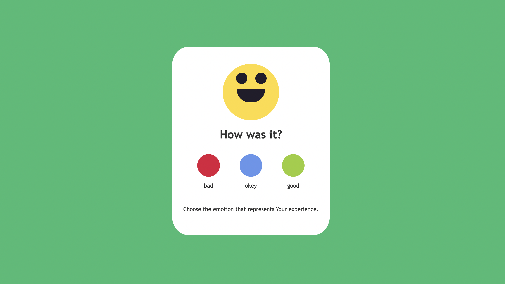
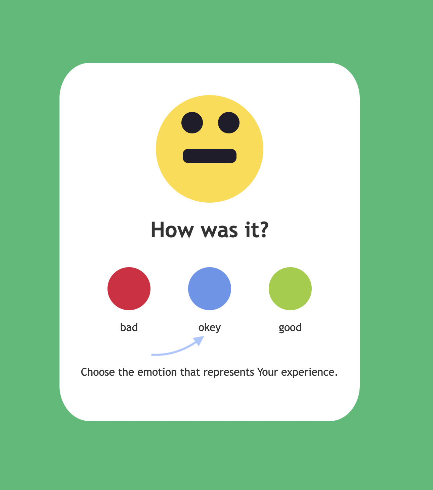
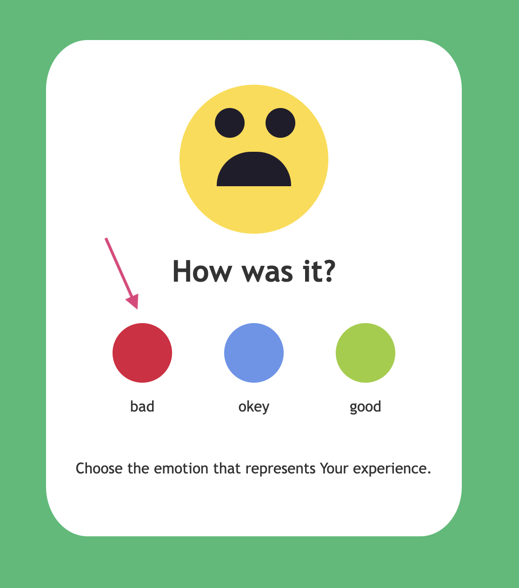

#   🎡 Rating widget 🎡

## 🌟 What's it about?

A funny widget, super simple, but I could try using all my JavaScript knowledge.  

## 🌟 First look 

when You click the "okey" button You'll see this

and by clicking red button, You'll see sad face

## 🌟 Technologies

+ HTML 5
+ CSS 3
+ JavaScript

## 🌟 Inspiration
This little project is part of an amazing Full Stack Developer Course created by  ♥ Ania Kubow ♥. Love this women, her sense of humor and ability to explain hard, code-things in a way that I finally understand. 🏆
You can check this course [here](https://www.codewithania.com/about) and I absolutely encourage You to visit her [YouTube](https://www.youtube.com/@AniaKubow) channel.
